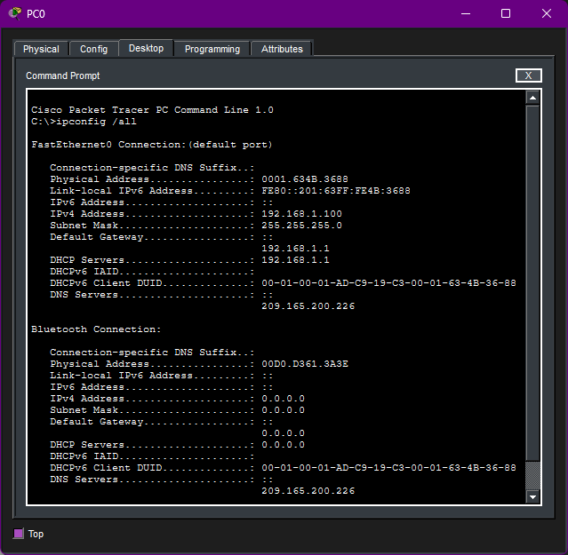
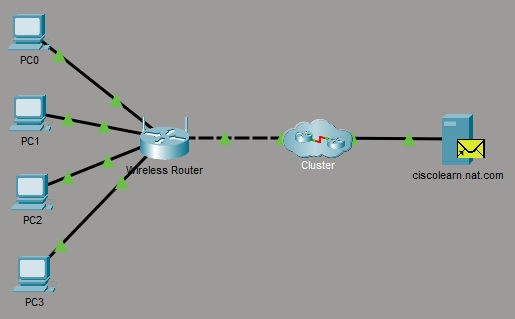
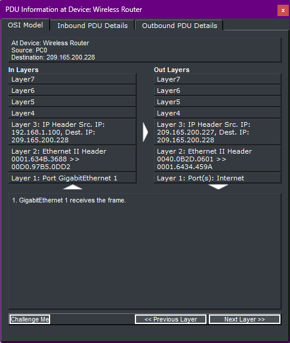
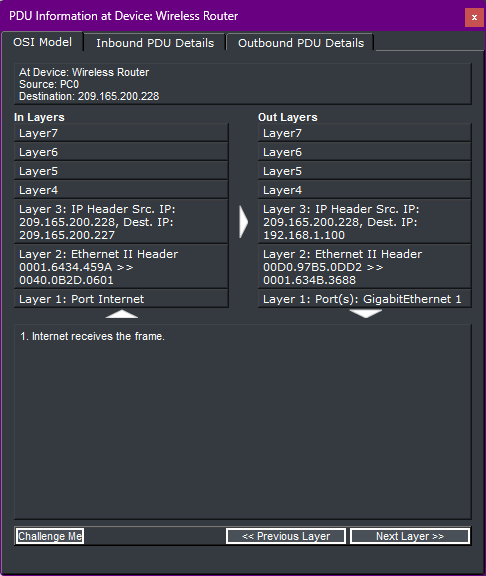

# ![fire] 12.2.2 - Examine NAT on a Wireless Router

## Objectives

Build a simple LAN and observe how NAT translates IP addresses on packets travelling from an internal network to external networks and vice versa.

## Methodology

### Part 1 - Examine the configuration for accessing external networks

1. Connected a PC to the wireless router and enabled DHCP on it, making it dynamically request for IP configuration values from the router's DHCP server. PC0 then set its IP address to 192.168.1.100 and default gateway address to 192.168.1.1.

2. Opened the web browser on PC0 and entered the IP address of the default gateway, accessing the router's configuration GUI.

3. Opened the "Status" menu option to visualize the router's public IP address (that is, the one assigned to its Internet port), obtained from the ISP's DHCP server: 209.185.200.227.

### Part 2 - Examine the configuration for accessing the internal network

1. Opened the "Local Network" submenu to visualize the router's private IP address and DHCP server information. As expected, the router's private IP address matched PC0's default gateway address. Also, PC0's given IP address matched the first address in the DHCP server pool.

### Part 3 - Connect 3 PCs to the wireless router

1. Added 3 other PCs to the network and connected them to the router, enabling DHCP on all of them. They all received IP addressing within the DHCP server's range.

2. Verified each PC's configuration by entering the command `ipconfig /all` in the Command Prompt, which displays IP, DHCP and DNS information for all NICs in the device.

### Part 4 - View NAT translation across the wireless router

1. Entered Simulation mode and changed the visible events to TCP and HTTP only, to view a simple example of network traffic and address translation between networks.

2. Created a periodic Complex PDU to simulate HTTP requests from PC0 to ciscolearn.nat.com.

3. Clicked play in the Simulation panel to visualize the traffic.

### Part 5 - View the header information of the packets that traveled across the network

1. Opened one of the PDUs leaving the LAN and verified the Inbound PDU details against the Outbound PDU details. The source IP address, which was originally private, was translated by NAT into a public IP address. In this case, PC0's private IP was replaced with the router's public IP.

2. Opened another PDU, this time, one entering the LAN, where the opposite occurred: the router's public IP address was translated into PC0's private IP address.

## Key Takeaway

NAT is a protocol capable of translating public IPv4 addresses into private ones and vice versa. It was very useful to delay the depletion of public IPv4 addresses because it enabled many hosts on a LAN to share a single public address. The translation occurs at the device serving as the gateway from the LAN to other networks.

[fire]: ../../Images/fire.png