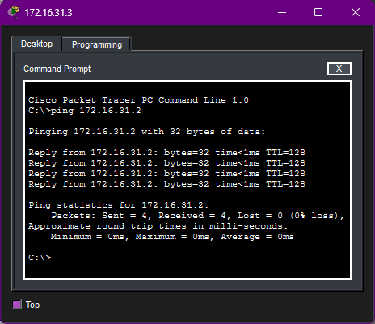
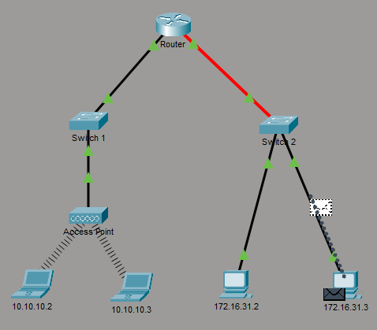
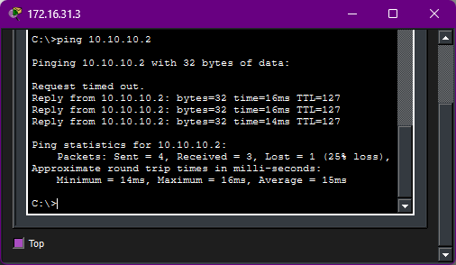

# ![fire] 13.1.3 - Identify MAC and IP Addresses

## Objectives

Observe PDUs travelling within the same network and between networks to verify how the header information from layers 2 and 3 changes.

## Methodology

### Part 1 - Gather PDU information for a local network communication

1. Opened the Command Prompt from host 172.16.31.3 and issued the command `ping 172.16.31.2`, which sends 4 ICMP Echo Requests to the specified destination. Four ICMP Echo Replies were received, confirming that the destination was reachable.

2. Entered Simulation mode and repeated the same command to view the process step-by-step.
3. Clicked the forward button and observed PDU information on each device on the route to the destination. For this same-network communication, the MAC and IP addresses were unchanged until the packet reached host 172.16.31.2. But once the destination replied, the layers 2 and 3 source and destination addresses were swapped. The Echo Request PDU was sent directly to the intended destination and so was the Echo Reply.

### Part 2 - Gather PDU information for a remote network communication

1. Entered Realtime mode and, from host 172.16.31.3, issued the command `ping 10.10.10.2`. Although not all Echo Requests received a Reply, it was still possible to determine the presence of a connection between both hosts.

2. Repeated the same command from Simulation mode, now to view the process between two different networks.
3. Clicked the forward button to verify PDU information once again. This time the Echo Request was not sent directly: although the destination IP address was the one entered in the command, the destination MAC address belonged to the router port connected to the 172.16.31.0/24 network.
This information remained unchanged until the PDU reached the router, and when it forwarded the message to the next network, another change occurred: the source MAC address belonged to its port connected to the 10.10.10.0/24 network and only now the destination MAC address was that of the intended destination. During the reply, a similar process occurred: in layer 2, the PDU was first addressed to the router and then to the original host; in layer 3, the IP addresses were swapped.

## Key Takeaway

When two hosts communicate on the same network, they are able to exchange messages directly, that is, they can address each other without the need for an intermediary device. For communications with remote networks however, a gateway is necessary, which will forward messages from one network to the next.

It was also possible to observe that Access Points are mere signal redistributors, like wireless hubs. The one in this laboratory did not interpret layer 2 or 3 information, only sharing the messages to all connected devices.

[fire]: ../../Images/fire.png